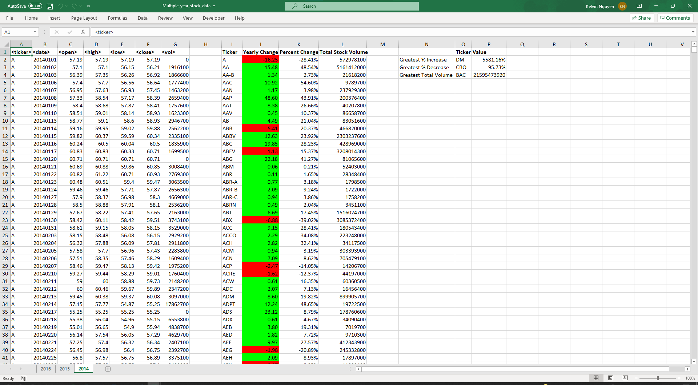
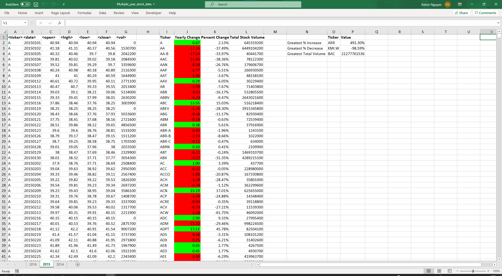
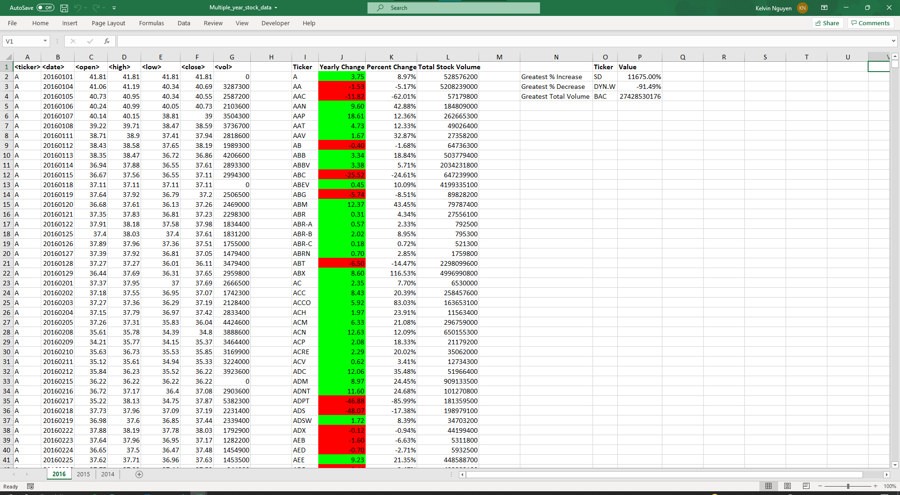

# Annual Stock Performance Macro

## Background

In this assignment, a VBA script was build for analyse real stock market data.

### Files

* [Test Data](Resources/alphabetical_testing.xlsx) (14 Mb) - for testing while developing the VBA scripts.

* [Stock Data](Resources/Multiple_year_stock_data.xlsx) (96 Mb) - includes 3 sheets, each contains about 800,000 records. The final scripts were run on this data to generate the final report.

## The script features:

* The script will loop through all the stocks for one year and output the following information:

  * The ticker symbol.

  * Yearly change from opening price at the beginning of a given year to the closing price at the end of that year.

  * The percent change from opening price at the beginning of a given year to the closing price at the end of that year.

  * The total stock volume of the stock.

* Return the stock with the "Greatest % increase", "Greatest % decrease" and "Greatest total volume". 

* VBA script will allow it to run on every worksheet/every year just by running the VBA script once.

## What's included

* A screen shot for each year of  results on the Multi Year Stock Data.

* [VBA scripts](VBA_challenge.vb) as a separate file.

